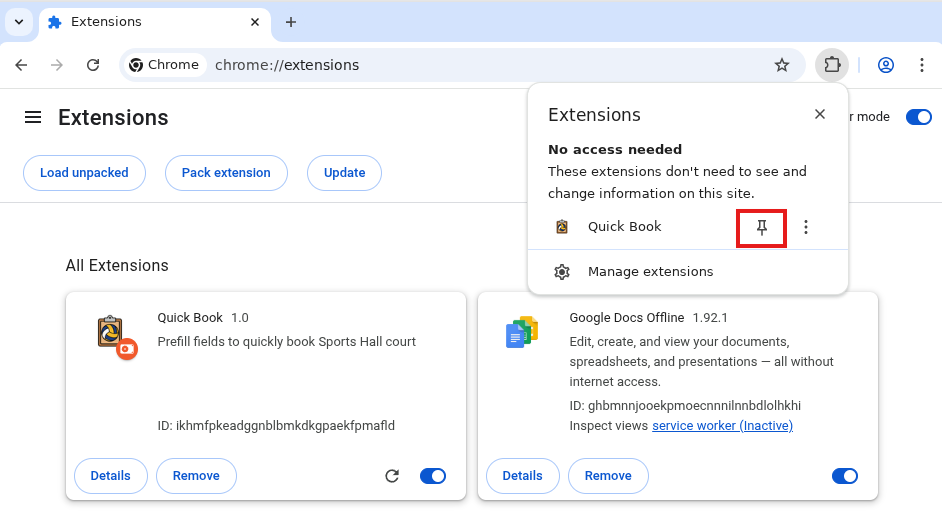
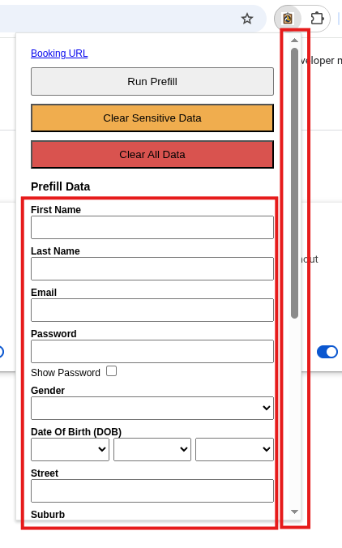
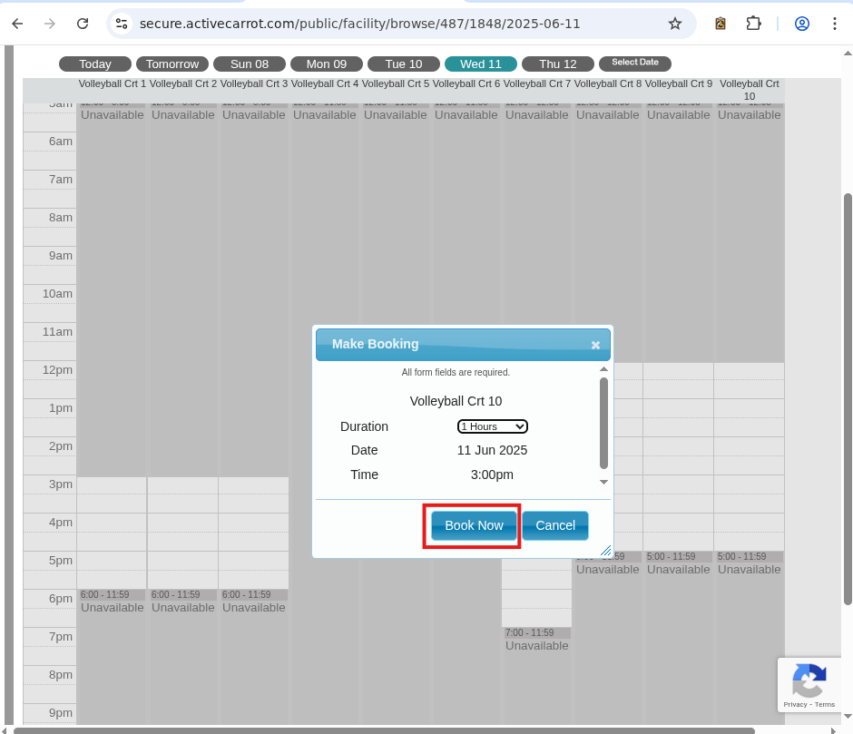
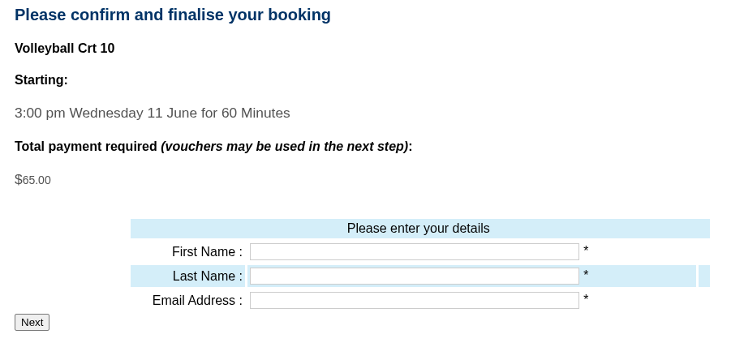
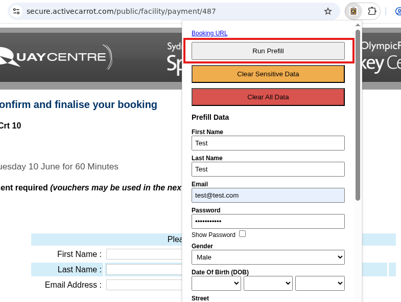
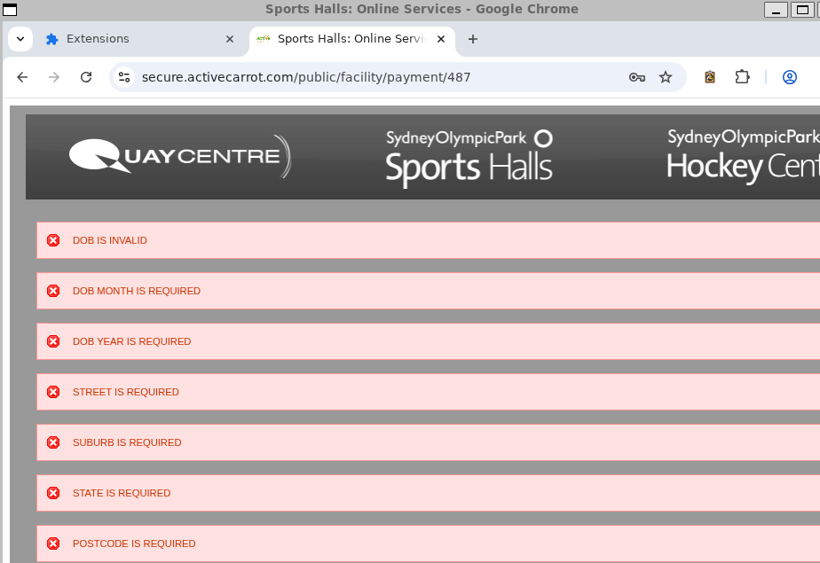

# Quick Book

Chrome extension to autofill the Sports Hall booking forms. It's a blood bath out there trying to book those courts so need to be speedy.

## Security Warning

There are sensitive fields required to be stored in the extension in order for the prefill to work. Please use the provided clear buttons after you have completed the booking process. If you have not cleared the data, in the case that your browser is compromised, **your credit card details and account password will be exposed**.

## How to use this extension

1. Pin the extension

2. Select the extension and fill in the fields. Note there is a scroll bar for more fields to fill in.

3. At 12AM, exactly 7 days before the target day you want to book, the booking will be available. Press the "Book Now" button as soon as this time comes.

4. You will be greeted with the initial form. Press the extension button and press the "Run Prefill" button.

5. If you have correctly, filled in the fields, then your booking should go through! If there are any issues with your prefilled data, errors will be displayed to inform you which field data you need to fix.

